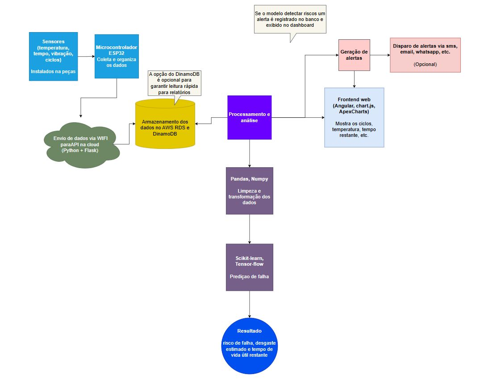
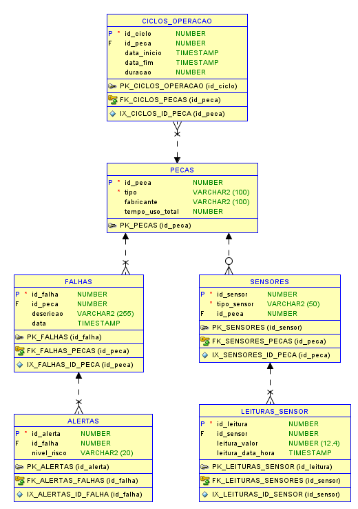
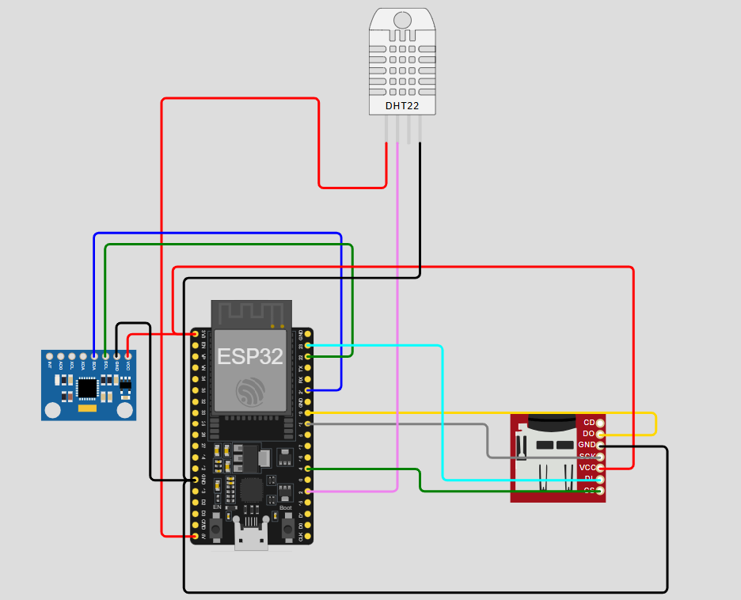
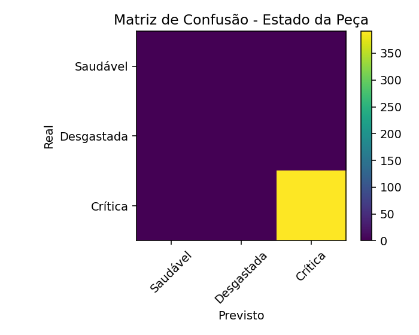
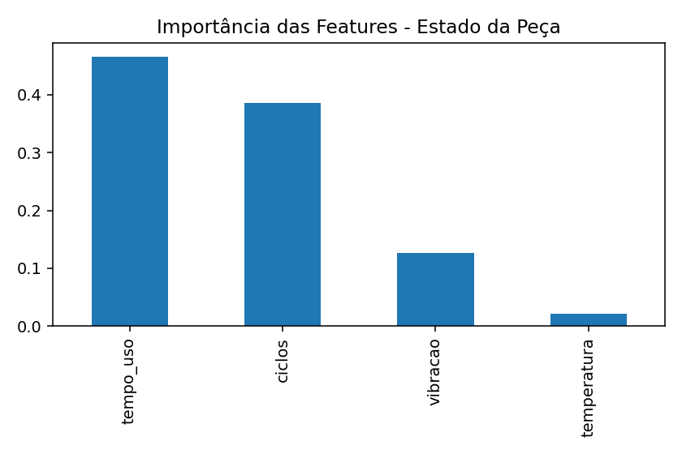
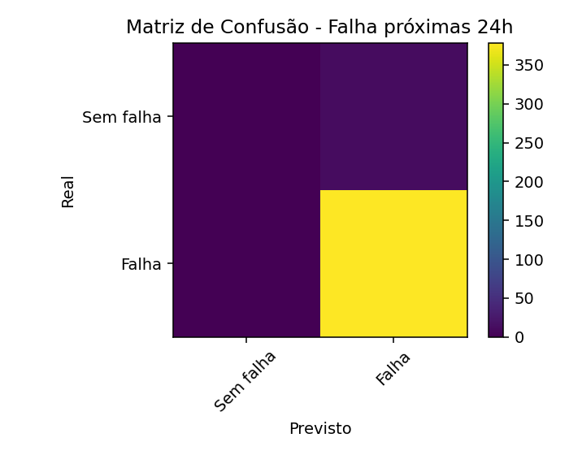
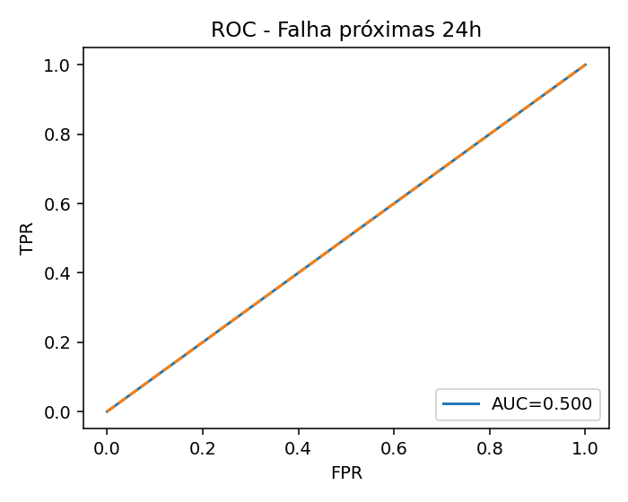

# FIAP - Faculdade de Informática e Administração Paulista 

<p align="center">
<a href= "https://www.fiap.com.br/"></a>
</p>

<br>

# FIAP x Hermes Reply — Monitoramento de Deterioração e Vida Útil das Peças

## Grupo Sp e Interior

## 👨‍🎓 Integrantes: 
- <a href="https://www.linkedin.com/in/jonastadeufernandes/?locale=en_US">Jonas Tadeu V Fernandes</a>
- <a href="">Levi Passos Silveira Marques</a>
- <a href="">Raphael da Silva</a> 
- <a href="[https://www.linkedin.com/company/inova-fusca](https://www.linkedin.com/in/raphael-dinelli-8a01b278/)">Raphael Dinelli Neto</a>

**Curso:** FIAP — Fase 6  
**Empresa parceira:** Hermes Reply  
**Tema:** Criação MVP ESP32 + Sensores IoT, Banco de Dados, modelo Machine Learning e dashboard/relatório

## 👩‍🏫 Professores:
### Tutor(a) 
- <a href="https://www.linkedin.com/company/inova-fusca">Leonardo Ruiz Orbana</a>
### Coordenador(a)
- <a href="https://www.linkedin.com/company/inova-fusca">André Godoi Chiovato</a>

## 📜 Descrição

# 🚜 Monitoramento de Deterioração e Vida Útil das Peças

Este projeto foi desenvolvido pelo grupo **SP e Interior** como parte do desafio proposto pela empresa **Hermes Reply**, em parceria com a FIAP. A proposta visa aplicar técnicas de **Machine Learning** e **IoT** para prever falhas e estimar a vida útil de componentes mecânicos utilizados em ambientes industriais.

Nosso objetivo é permitir **manutenção preditiva**, minimizando o tempo de máquina parada e reduzindo custos operacionais.

MVP fim-a-fim de **manutenção preditiva** integrando:
**sensores (simulados)** → **API Flask** → **MySQL** → **ML (batch)** → **Dashboard (Jinja + Chart.js)** → **Alertas**.

---

## 🎯 Objetivo do Sistema

Estimar a vida útil de peças e componentes com base em:

- Tempo de uso (em horas)
- Número de ciclos de operação (liga/desliga)
- Registro de temperatura durante o funcionamento
- Dados de vibração (opcional)
- Histórico de falhas anteriores

Esses dados serão processados por modelos de Machine Learning que irão prever o risco de falha iminente e gerar alertas automatizados.

---

## 🧠 Tecnologias Utilizadas

## 🧠 Tecnologias Utilizadas

| Camada               | Tecnologia                                      | Observações |
|----------------------|--------------------------------------------------|-------------|
| Ingestão/API         | Flask, Flask-Admin, Flask-Migrate, Flask-CORS    | Endpoints REST + painel admin |
| Banco de Dados       | MySQL 8 + Adminer                                | DDL auto-executado no init do container |
| ORM/Migrações        | SQLAlchemy + Alembic                             | Migrações habilitadas |
| Simulador            | Python (requests)                                | Serviço `simulator` no docker-compose |
| ML                   | scikit-learn, pandas, numpy, joblib              | Treino batch a partir do banco/CSV |
| Dashboard            | Jinja2 + Chart.js                                | Séries reais + snapshot de risco |
| Contêineres          | Docker Compose                                   | Serviços: `db`, `adminer`, `web`, `simulator` |

---

## 🔌 Pipeline de Dados

1. **Coleta de Dados (ESP32)**  
   - Tempo de uso
   - Temperatura
   - Ciclos de operação
   - Vibração (opcional)

2. **Envio dos Dados (simulado via script Python)**  
   - Comunicação com o banco de dados

3. **Armazenamento (AWS RDS / DynamoDB)**  
   - Histórico estruturado e seguro

4. **Processamento (EC2)**  
   - Modelos de ML treinados para predição de falhas. A predileção por EC2 ao invés de ambiente local é devido a custos e facilidade de manutenção da infra-estrutura.

5. **Visualização e Alertas**  
   - Dashboards e alertas automatizados com base nas previsões
---

**Fluxo resumido:**
1. **Simulador** envia leituras (`POST /api/readings`) a cada `INTERVAL_SEC`.  
2. **API Flask** valida e persiste em `LEITURAS_SENSOR`; regra simples gera **FALHAS**/**ALERTAS**.  
3. **Batch ML** lê do MySQL e gera `sensores.csv` (`app.generate_csv`).  
4. Scripts de treino geram modelos:  
   - `modelo_falha_24h.joblib` (falha nas próximas 24h)  
   - `modelo_estado_peca.joblib` (Saudável/Desgastada/Crítica)  
5. **Dashboard** consome endpoints (`/api/readings/series`, `/api/predict/snapshot`) e exibe KPIs/gráficos.

---

## 🖼️ Arquitetura da Solução

A imagem abaixo representa a arquitetura proposta do sistema, integrando sensores, banco de dados e modelos de IA:



---

## 🧱 Modelagem de Banco de Dados

### Principais Entidades:

**Tabelas** (MySQL 8, adaptado do DER Oracle):
- `PECAS` (PK `id_peca`)
- `SENSORES` (PK `id_sensor`, FK → `PECAS`)
- `CICLOS_OPERACAO` (PK `id_ciclo`, FK → `PECAS`)
- `LEITURAS_SENSOR` (PK `id_leitura`, FK → `SENSORES`)
- `FALHAS` (PK `id_falha`, FK → `PECAS`)
- `ALERTAS` (PK `id_alerta`, FK → `FALHAS`)

**Chaves & Integridade:**
- `SENSORES.id_peca` com `ON DELETE SET NULL`
- `CICLOS_OPERACAO.id_peca`, `FALHAS.id_peca`, `ALERTAS.id_falha` com `ON DELETE CASCADE`
- Índices em FKs para desempenho.

### Relacionamentos:

- Uma peça possui vários sensores (1:N)
- Uma peça possui vários ciclos de operação (1:N)
- Cada ciclo possui várias leituras (1:N)
- Uma peça pode ter várias falhas (1:N)
- Cada falha pode gerar múltiplos alertas (1:N)

### DDL
 - `src/app/database/DDL.sql`

### DER
Imagem exportada do Oracle SQL Developer Data Modeler:
- `assets/Diagrama-ER.png`

<p align="center">
  
</p>

### Script DDL
- `src/app/database/DDL.sql`

**Criação automática (primeiro start):**  
`src/app/database/DDL.sql` é montado no container MySQL (init script).  
Volume `dbdata` preserva dados entre reinícios.

---

## 📊 Estratégia de Coleta de Dados

Nesta fase inicial, os dados serão **simulados** por meio de scripts Python que imitam a operação dos sensores conectados a um ESP32.

## 🔌 Coleta e Ingestão

**Simulador** (`services.simulator` no compose) envia:
```json
POST /api/readings
{
  "id_sensor": 1,
  "leitura_valor": 55.2,
  "leitura_data_hora": "2025-10-04T12:00:00Z"
}

Serão gerados:

- Ciclos de operação aleatórios
- Leituras de temperatura variando com o tempo
- Eventos de falha simulados para treinar o modelo

Alertas/Falhas:
No endpoint /api/readings, um limiar + streak gera registros em FALHAS e ALERTAS.

**Script para consolidação dos dados das tabelas sql em arquivo csv**: `src/database/csv_create.sql`

---

## ESP32 e Sensores IoT



### Microcontrolador ESP323

O microcontrolador ESP32 é o hardware principal, sendo ele responsável pegar os dados analisar e enviar via internet os dados a uma planilha do Google Sheet.

### Sensor DHT22 (Leitura de temperatura)

O sensor DHT22 é utilizado para fazer a leitura da temperatura da peça, fazendo controle total do equipamento.

### Sensor MPU6050 (Simulando sensor de vibração nós 3 eixos)

A utilização do MPU é pela vantagem de trabalhar com os 3 eixos, sem a necessidade de implementar 3 potenciometro. Assim, sendo que em cada eixo é analisando individualmente, caso um dos eixos não esteja no limite padrão, aparecerá na planilha **"HIGH" para uma alta vibração** e **"NORMAL" caso esteja na vibração limite**. 

### Módulo SD Card (Para backup)

Pensando em modo de backup, será gravado num cartão SD as informçãoes dos sensores, em paralelo a gravação na planilha do Google, abrindo o arquivo **data.csv** para gravação.

### Google Sheet

Utilizando a extensão do Google Sheet, o **App Script**, é capaz de receber os dados do ESP32 via WiFi e assim, fazer a gravação na planilha. <br>
link planilha: https://docs.google.com/spreadsheets/d/1SxSW1ptz34iY43gRZqWlB8mrXascj9ZLxu0J4P3hlF8/edit?usp=sharing

## 📊 Dashboard e API

- **Dashboard** (`/`): KPIs e gráficos (Chart.js)
- **Série temporal**: `/api/readings/series?sensor_id=...&minutes=...`
- **Snapshot ML**: `/api/predict/snapshot?threshold=0.5&temp_minutes=15&vib_minutes=5`
- **Admin**: `/admin` (Flask-Admin)
- **Healthcheck**: `/health`
- **Listar sensores**: `/api/sensors`

---
## Dados Utilizados
- **CSV**: `src/app/database/sensores.csv`  
  - Colunas: `id_leitura, id_sensor, id_peca, sensor_tipo, leitura_data_hora, tempo_uso, ciclos, temperatura, vibracao, falha, risco_falha`  
  - **Observação:** as colunas `temperatura` e `vibracao` são valores consolidados “último conhecido por peça” até o timestamp.

---

## 🤖 Machine Learning Integrado

### Dataset a partir do banco
O módulo `app.generate_csv` lê o MySQL e gera **`/app/app/database/sensores.csv`** com colunas:
id_leitura, id_sensor, id_peca, sensor_tipo, leitura_data_hora,
tempo_uso, ciclos, temperatura, vibracao,
falha_evento, # 1 se houver FALHAS na peça no instante (match tolerância)
falha, falha_prob, risco_falha # inferência atual via modelo

### Modelo 1 — Classificação do estado da peça
- **Arquivo:** `src/ml/part_status_classifier.py`  
- **Problema:** multiclasse (Saudável / Desgastada / Crítica), mapeado do rótulo `risco_falha`.  
- **Features:** `tempo_uso`, `ciclos`, `temperatura`, `vibracao`.  
- **Algoritmo:** `RandomForestClassifier`.  
- **Split temporal:** 70% início → treino; 30% final → teste.  
- **Artefatos gerados:**  
  - `assets/matriz_confusao_estado.png`  
    <p align="center"></p>

  - `assets/feature_importance_estado.png`  
    <p align="center"></p>

  - `src/machine-learning/models/modelo_estado_peca.joblib`

### Modelo 2 — Previsão de falha nas próximas 24h
- **Arquivo:** `src/ml/machine-learning/failure_predict24_hours.py`  
- **Problema:** binário (falha nas próximas 24h).  
- **Rótulo:** `fail_next_h` (1 se existir `falha==1` para a **mesma peça** em `(t, t+24h]`).  
- **Features:** básicas + janelas móveis (médias, desvios e deltas 3/6/12 passos).  
- **Algoritmo:** `GradientBoostingClassifier`.  
- **Split temporal:** 70%/30%.  
- **Artefatos:**  
  - `assets/matriz_confusao_falha_24h.png`  
    <p align="center"></p>

  - `assets/roc_falha_24h.png` 
    <p align="center"></p>

  - `src/machine-learning/models/modelo_falha_24h.joblib`

### Resultados

- **Classificação (estado da peça):**  
  - Accuracy = **1.00**  
  - Macro-F1 = **1.00**  
  - Principais variáveis: tempo_uso (46.6%), ciclos (38.6%), vibração (12.6%), temperatura (2.1%).  

- **Previsão de falha (24h):**  
  - Accuracy = **0.967**  
  - ROC-AUC = **0.50**  
  - F1 (classe 1 = falha) = **0.983**  
  - Observação: o modelo aprendeu quase apenas a prever a classe “falha”. Isso ocorreu devido ao forte **desbalanceamento de classes** (378 falhas vs. 13 não-falhas). Em projetos reais, técnicas de reamostragem, ajuste de limiar e uso de métricas específicas (F1/Recall da classe minoritária) seriam necessárias.

  > **Justificativa dos gráficos**  
> - **Matriz de confusão:** mostra acertos/erros por classe.  
> - **Importância de features:** explica a contribuição relativa de cada variável no modelo 1.  
> - **Curva ROC/AUC:** avalia separação entre classes no modelo 2 para diferentes limiares.

---

## ▶️ Como Executar (Reprodutibilidade)

**Pré-requisitos:** Docker Desktop com Compose.

**Subir tudo (na pasta `src/`):**
```bash
docker compose up --build

Web: http://localhost:5001

Adminer: http://localhost:8080
 (Server: db; User: app; Pass: app; DB: challenge)


Ver logs:

```bash
docker compose logs -f web simulator


Gerar CSV a partir do banco:

```bash
docker compose exec web python -m app.generate_csv


Treinar modelos:

# Falha 24h
```bash
docker compose exec web python -m app.ml.failure_predict_24_hours

# Estado da peça
```bash
docker compose exec web python -m app.ml.piece_state_classifier

# (opcional) recarregar web para lazy-load de modelos
```bash
docker compose restart web


Testar endpoints:

curl http://localhost:5001/health
curl "http://localhost:5001/api/sensors"
curl -X POST http://localhost:5001/api/readings -H "Content-Type: application/json" \
  -d '{"id_sensor":1,"leitura_valor":55.2,"leitura_data_hora":"2025-10-04T12:00:00Z"}'


Reset do banco (opcional):

docker compose down -v   # remove volume dbdata
docker compose up --build

---

## Estrutura do Repositório

```bash
assets/
  logo-fiap.png
  fiap_reply_mvp.png
  ... (gráficos gerados pelos treinos)

docs/
  arquitetura/
    fiap_reply_mvp.drawio
    fiap_reply_mvp.png

src/
  docker-compose.yml
  requirements.txt
  Dockerfile
  app/
    wsgi.py
    config.py
    extensions.py
    models.py
    database/
      DDL.sql
      sensores.csv
    api/
      routes.py
      cycles.py
      alerts.py
    views/
      template/
        dashboard.html
      static/
        js/...
        css/...
    simulator/
      sensor_sim.py
    ml/
      predict.py
      failure_predict_24_hours.py
      piece_state_classifier.py
      # modelos salvos em:
      # /app/app/ml/modelo_falha_24h.joblib
      # /app/app/ml/modelo_estado_peca.joblib
    generate_csv.py

```

## Link do video explicativo: 

- https://www.youtube.com/watch?v=gZ8fwobi3Y4

## ✅ Mapeamento aos Requisitos do Challenge
✅ 4.1 Arquitetura Integrada: diagrama em docs/arquitetura/ com fluxos, formatos (JSON/CSV) e periodicidades.
✅ 4.2 Coleta e Ingestão: simulador Python (serviço simulator) + logs e séries no dashboard.
✅ 4.3 Banco de Dados: DDL em src/app/database/DDL.sql, chaves e restrições documentadas.
✅ 4.4 ML Básico Integrado: treino batch a partir do banco/CSV, métricas e figuras (matriz/ROC/feature importance).
✅ 4.5 Visualização e Alertas: dashboard com KPIs e alertas por threshold/streak; endpoints públicos.
✅ 4.6 Reprodutibilidade: Dockerfile, docker-compose.yml, requirements.txt, passos de execução no README.

---

## 📈 Resultados (exemplo)
Estado da Peça: relatório de classificação + matriz de confusão; importância de features.

Falha 24h: ROC-AUC e matriz de confusão.

Em dados altamente desbalanceados, ajustar limiares e analisar métricas por classe.
O simulador pode ser parametrizado para gerar mais FALHAS (reduzindo ALERT_THRESH e ALERT_MIN_STREAK) para enriquecer o treinamento.

## 🧩 Decisões Técnicas
MySQL em container com Adminer → rápida avaliação e reprodutibilidade.
Execução do DDL no init do MySQL → “migrations” iniciais sem fricção.
Simulador separado do backend → desacoplamento e fácil ajuste de volume de dados.
Modelos em app/ml → a API carrega .joblib dessa pasta (padronização).
Chart.js no front → simplicidade e leveza.
Flask-Admin → CRUD mínimo para avaliação.

## 🛠️ Troubleshooting
TemplateNotFound dashboard.html: confirme views/template (sem “s”) e Blueprint(..., template_folder="template").
NameError: and_ is not defined: importe from sqlalchemy import and_ nos endpoints.
left keys must be sorted (merge_asof): o generate_csv.py já faz sort_values por peça e timestamp.
Input X contains NaN: pipeline faz imputação (ffill/bfill + mediana). Gere CSV novamente.
y contains 1 class no treino: gere FALHAS (ajuste thresholds/streak) → gere CSV → re-treine.
Modelo não encontrado: confirme .joblib em /app/app/ml e reinicie web.


## 🗃 Histórico de lançamentos
* 0.2.0 - 09/09/2025
* 0.3.0 - 28/09/2025
* 1.0.0 — 04/10/2025 (MVP integrado com Docker, ingestão, ML e dashboard)

## 📋 Licença

<p xmlns:cc="http://creativecommons.org/ns#" xmlns:dct="http://purl.org/dc/terms/"><a property="dct:title" rel="cc:attributionURL" href="https://github.com/agodoi/template">MODELO GIT FIAP</a> por <a rel="cc:attributionURL dct:creator" property="cc:attributionName" href="https://fiap.com.br">Fiap</a> está licenciado sobre <a href="http://creativecommons.org/licenses/by/4.0/?ref=chooser-v1" target="_blank" rel="license noopener noreferrer" style="display:inline-block;">Attribution 4.0 International</a>.</p>


